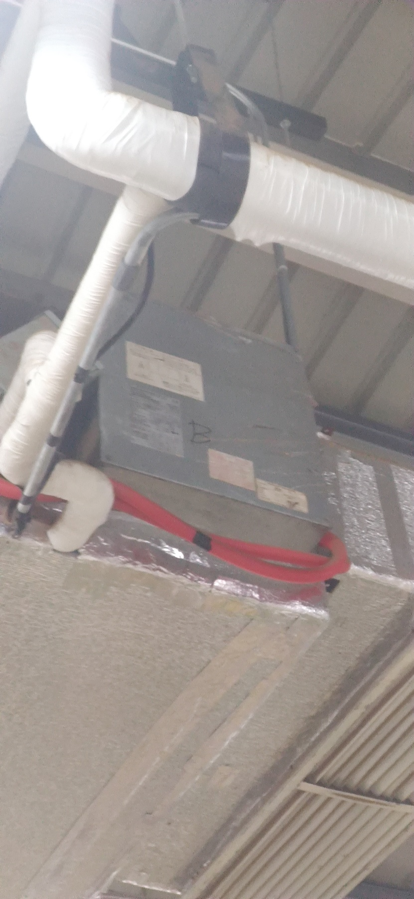
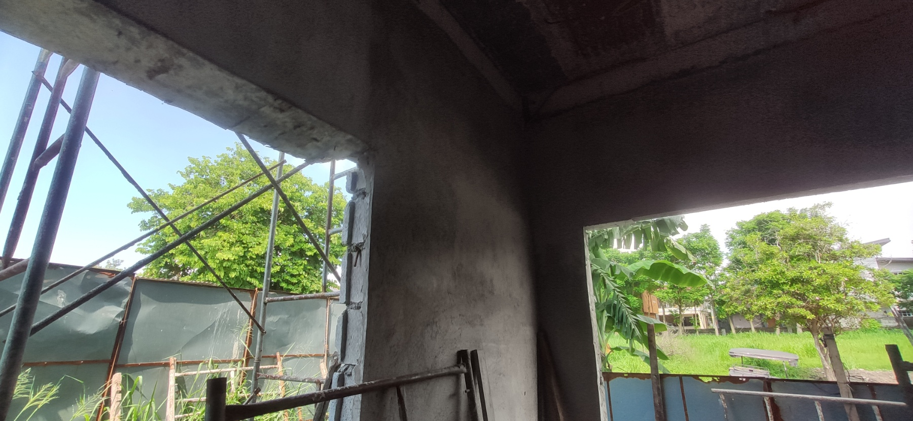
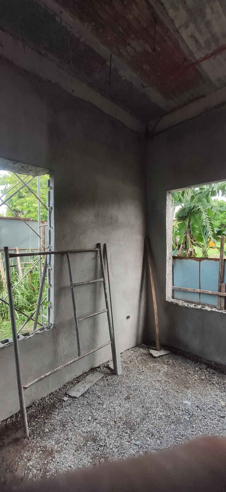

# WEEKLY REPORT 39

**Weekly Progress Report**

**Summary Progress Report**
| Project/Task Details      | Completion | Remarks |
| ------------------------- | ---------- | ------- |
| SWAK BPO RELOCATION AND INSTALLATION   | - 90%      |  Drain/works and adjustment  |
| HANN TEMFACIL                 | 0%       | REVISED QUOTATION TO P2,190,000.00 LOA SUBMITTED TO HANN    |
| Aeropark 717 COFFEE SHOP                 | PENDING FOR APPROVAL       | VRF SUPPLY INSTALLATION   |
| OFFICE CLARK 10                 | PENDING FOR APPROVAL       | SUPPLY & INSTALLATION   |
| SWAK BPO 5TH FLOOR                | PENDING FOR APPROVAL       | RELOCATION AND INSTALLATION   |
| SWAK BPO KITCHEN               | PENDING FOR APPROVAL       | KITCHEN AND ADDITONAL ON 2ND FLOOR    |
| WEST GO CHIEFT DUCTED TYPE ACU              | PENDING FOR APPROVAL       | SUPPLY & INSTALLATION    |

